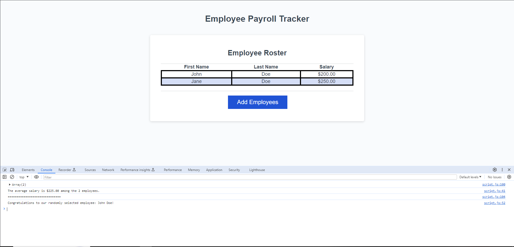

# Payroll-Tracker

## Description
This project was created in order to provide practice for storing, displaying, and calculating with entered values, by example of a way to track employee payrolls for budgeting purposes

## Usage
The page opens with a blank grid and a single button. Through pressing the button to add employees, the user is prompted to fill in several pop ups until it contains as many employees as they would like. Upon hitting cancel for if the user is finished entering information, the site updates itself with a new grid of information! You can even view additional information of the average salary of employees and a randomly selected employee by opening the inspect view of the website by right clicking and hiting inspect. From the inspect view after having entered the prompts, you can now see an average salary for the listed employees along with a randomly selected employee.
 Please feel free to view the results on the [finished page](https://dylan-thrasher.github.io/Payroll-Tracker/).

 
